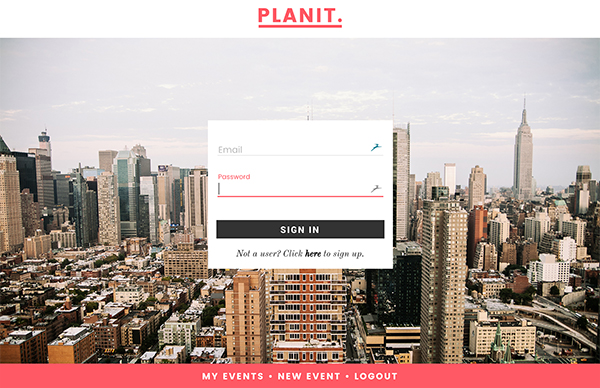
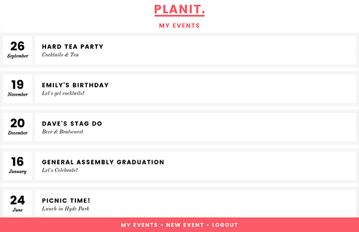
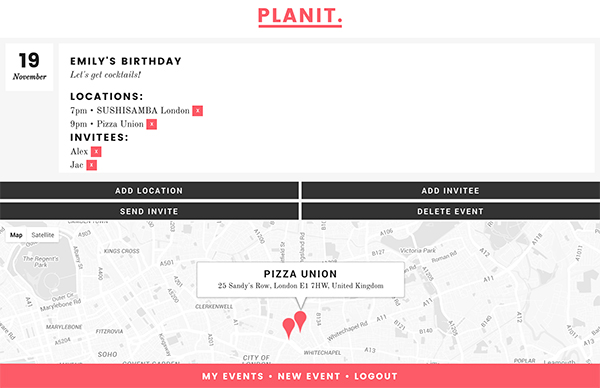

# PLANIT

###GA WDI London - Project 2

####An event itinerary creation app

#####[View it here!](https://planit-event-app.herokuapp.com/ "Here!")

####The App

Users can sign up, login, and create events. Locations and invitees can be added to an event, and once the user is happy, they can email out the itinerary to everyone on the guest list.

####The build

* Built with Node, Express & MongoDB 
* Front-end in Angular & Angular Material
* Google Maps & Google Places APIs
* Nodemailer & Email Template
* The Google Web Font 'Poppins' has been used to style the game.

#### Problems & Challenges

The main issue I faced whilst building this app, was integrating Google Maps API, as it needs to initialize when the page loads. As my map div is not visible when the app first starts, this caused some errors. I also had some CORS issues upon deployment.